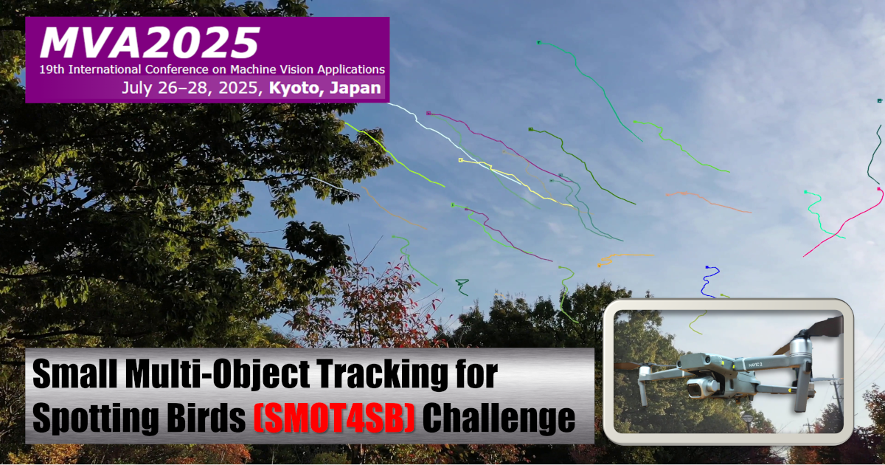

# MVA2025-SMOT4SB Baseline Code

<p align="center">
  
</p>


<div align="center">

🏆 [**Challenge Page**](https://mva-org.jp/mva2025/challenge) **|** 📂 [**Dataset**](https://drive.google.com/drive/folders/1Y1J13W6VlgDh-L28n_mVbs7HIfo_Hv5s?usp=sharing) **|** 🔥 [**Baseline Code**](https://github.com/IIM-TTIJ/MVA2025-SMOT4SB) **|** 📊 [**Leaderboard**](https://www.codabench.org/competitions/5101/)

[](https://github.com/IIM-TTIJ/MVA2025-SMOT4SB/stargazers)
[](https://github.com/IIM-TTIJ/MVA2025-SMOT4SB/network/members)
[](https://github.com/IIM-TTIJ/MVA2025-SMOT4SB/blob/main/LICENSE)
[](https://www.python.org/downloads/)
[](https://github.com/IIM-TTIJ/MVA2025-SMOT4SB/issues)

</div>


## 🏆 About SMOT4SB Challenge

The **SMOT4SB (Small Multi-Object Tracking for Spotting Birds)** challenge aims to advance object tracking and detection techniques for small objects in real-world scenarios. Participants are expected to develop tracking methods that improve the **SO-HOTA (Small Object Higher-Order Tracking Accuracy)** metric, a new evaluation criterion tailored for this challenge.

🔹 **Task**: Small Multi-Object Tracking<br>
🔹 **Dataset**: SMOT4SB dataset<br>
🔹 **Metric**: SO-HOTA<br>

For more details, visit the [**challenge webpage**](https://mva-org.jp/mva2025/challenge).

Additionally, the [**SOD4SB Challenge@MVA2023**](https://www.mva-org.jp/mva2023/index.php?id=challenge) baseline model ([GitHub repository](https://github.com/IIM-TTIJ/MVA2023SmallObjectDetection4SpottingBirds)) and dataset ([Google Drive](https://drive.google.com/drive/u/1/folders/1vTHiIelagbzPO795yhOdNUFh9u2XxZP-)) are also available for use.

### Submission format

The submission format follows the TrackEval's format, which is based on the MOT Challenge format, as shown below:  

```txt  
1,1,912,484,97,109,0,7,1  
2,1,912,484,97,109,0,7,1  
3,1,912,484,97,109,0,7,1  
...
```

The meaning of each column may differ between ground truth (GT) and predictions (pred). Please refer to the table below for details.

<table>
   <tr>
      <th>cols</th>
      <th>GT</th>
      <th>pred</th>
   </tr>
   <tr>
      <td align="center">1</td>
      <td colspan="2" align="center">frame</td>
   </tr>
   <tr>
      <td align="center">2</td>
      <td colspan="2" align="center">track id</td>
   </tr>
   <tr>
      <td align="center">3</td>
      <td colspan="2" align="center">bbox left</td>
   </tr>
   <tr>
      <td align="center">4</td>
      <td colspan="2" align="center">bbox top</td>
   </tr>
   <tr>
      <td align="center">5</td>
      <td colspan="2" align="center">bbox width</td>
   </tr>
   <tr>
      <td align="center">6</td>
      <td colspan="2" align="center">bbox height</td>
   </tr>
   <tr>
      <td align="center">7</td>
      <td align="center">evaluation flag<br>(0 means not evaluated)</td>
      <td align="center">confidence<br>(evaluated even if 0)</td>
   </tr>
   <tr>
      <td align="center">8</td>
      <td colspan="2" align="center">class id (fixed 1 for bird only)</td>
   </tr>
   <tr>
      <td align="center">9</td>
      <td colspan="2" align="center">visibility ratio (set to 1)</td>
   </tr>
</table>

## 🚀 About Baseline Code

### Requirements

- Python 3.8.20
- FFmpeg (Required if using the visualizer in scripts/visualize_for_mot_sub.py)

### 📌 Quick Start


#### 0️⃣ Clone the repository with submodules

To properly clone this repository along with its submodules, use the following command:

```sh
git clone --recurse-submodules https://github.com/IIM-TTIJ/MVA2025-SMOT4SB.git
cd MVA2025-SMOT4SB
```

#### 1️⃣ Dataset preparation

Download the SMOT4SB dataset from [here](https://drive.google.com/drive/folders/1Y1J13W6VlgDh-L28n_mVbs7HIfo_Hv5s?usp=sharing), and place it under `datasets`. The directory structure should look like this:

```
datasets
└ SMOT4SB
　 ├ train
　 ├ pub_test
　 ├ private_test
　 └ annotations
```

After that, run the following command to format the dataset according to the baseline code and place it in `OC_SORT/datasets`:

```sh
python3 scripts/prepare_dataset.py
```

**Note:** If you run this script again, you will encounter an error because symbolic links have already been placed in `OC_SORT/datasets`. In that case, make sure to run the following command before executing the script to unlink the symbolic links:

```sh
find OC_SORT/datasets/SMOT4SB -type l -exec unlink {} \;
```

#### 2️⃣ Package installation

```sh
pip3 install -r requirements.txt
pip3 install git+https://github.com/cocodataset/cocoapi.git#subdirectory=PythonAPI
cd OC_SORT
python3 setup.py develop
cd ..
```

#### 3️⃣ Training

First, run the following command under the project root to get the COCO-pretrained YOLOX model and save it under OC_SORT/pretrained:
   
```sh
mkdir OC_SORT/pretrained
wget -P OC_SORT/pretrained https://github.com/Megvii-BaseDetection/storage/releases/download/0.0.1/yolox_l.pth
```

You can also use any model from [this link](https://github.com/Megvii-BaseDetection/YOLOX/tree/0.1.0?tab=readme-ov-file#benchmark).

To train the model, run the following command:

```sh
sh scripts/train.sh -f OC_SORT/exps/smot4sb.py -d 8 -b 48 --fp16 -c OC_SORT/pretrained/yolox_l.pth
```

Outputs will be saved under `YOLOX_outputs/smot4sb`.

#### 4️⃣ Prediction

To make predictions using the trained model, run the following command:

```sh
sh scripts/predict.sh -f OC_SORT/exps/smot4sb.py --path OC_SORT/datasets/SMOT4SB/pub_test --ckpt YOLOX_outputs/smot4sb/best_ckpt.pth.tar
```

Outputs will be saved under `YOLOX_outputs/smot4sb/predictions` as MOT Challenge format.

#### 5️⃣ Submission

To submit the predictions, you need to compress the prediction txt files into a zip file. Run the following command to do so:

```sh
python3 scripts/create_submission.py -i YOLOX_outputs/smot4sb/predictions/pub_test/
```

The submission file will be saved as `<YYYY-MM-DD_hh-mm-ss>.zip`.

Once the submission file is generated, go to the [**CodaBench Submission Page**](https://www.codabench.org/competitions/5101/#/participate-tab) and upload your zip file under the **My Submission** tab. Your submission will be evaluated automatically, and the results will be displayed on the leaderboard.


### 🧰 How to use a tools

#### 👁️ Visualization

To visualize the predictions, run the following command:

```sh
python3 scripts/visualize_for_mot_ch.py -m YOLOX_outputs/smot4sb/predictions/pub_test/0001.txt -o visualized_video -i OC_SORT/datasets/SMOT4SB/pub_test/0001 --mp4 --show-bbox
```

This will generate a video named `visualized_video.mp4` in the cwd.

The `0001` represents the video name, matching a subdirectory under `datasets/SMOT4SB/pub_test`. To process a different video, replace `0001` in both the `-m` and `-i` options with the corresponding video name.

#### 📊 Evaluation for validation dataset

For evaluation, the ground truth (GT) and predictions must be in the format and directory structure compatible with TrackEval. The following commands prepare the necessary files:

```sh
# Make predictions on the validation data
sh scripts/predict.sh -f OC_SORT/exps/smot4sb.py --path OC_SORT/datasets/SMOT4SB/val --ckpt YOLOX_outputs/smot4sb/best_ckpt.pth.tar

# Modify the directory structure of the predictions
python scripts/cp_preds_for_eval.py -i YOLOX_outputs/smot4sb/predictions/val/ -o eval_inputs

# Prepare the GT
python3 scripts/oc_sort_ann_to_mot_ch.py -i OC_SORT/datasets/SMOT4SB/annotations/val.json -o eval_inputs
```

The conversion results will be output to the `eval_inputs` directory.

Next, evaluate using the following command:

```sh
python3 TrackEval/scripts/run_smot4sb_challenge.py eval_inputs eval_outputs val --metric-smot4sb
```

The evaluation results will be saved in the `eval_outputs` directory.

## 🎥 Demos & Results
📌 Sample detection and tracking results:

<table>
  <tr>
    <td align="center">
      <a href="https://drive.google.com/file/d/1ZQ57Js4XpIRcRZJDLL0as5weVHQADvA4/view?usp=sharing" target="_blank">
        
      </a>
      <br><a href="https://drive.google.com/file/d/1ZQ57Js4XpIRcRZJDLL0as5weVHQADvA4/view?usp=sharing" target="_blank">Public test (0001)</a>
    </td>
    <td align="center">
      <a href="https://drive.google.com/file/d/1igln2MC5PWDEG2oiJFyEOEN6x4JaaRH7/view?usp=drive_link" target="_blank">
        
      </a>
      <br><a href="https://drive.google.com/file/d/1igln2MC5PWDEG2oiJFyEOEN6x4JaaRH7/view?usp=drive_link" target="_blank">Public test (0004)</a>
    </td>
  </tr>
</table>


## 📜 Citation

If you use this baseline, please cite:
```bibtex
@inproceedings{kondo2025smot4sb,
  title     = {{MVA 2025 Small Multi-Object Tracking for Spotting Birds Challenge: Dataset, Methods, and Results}},
  author    = {Yuki Kondo and Norimichi Ukita and Riku Kanayama and Yuki Yoshida and Takayuki Yamaguchi and Xiang Yu and Guang Liang and Xinyao Liu and Guan-Zhang Wang and Wei-Ta Chu and Bing-Cheng Chuang and Jia-Hua Lee and Pin-Tseng Kuo and I-Hsuan Chu and Yi-Shein Hsiao and Cheng-Han Wu and Po-Yi Wu and Jui-Chien Tsou and Hsuan-Chi Liu and Chun-Yi Lee and Yuan-Fu Yang and Kosuke Shigematsu and Asuka Shin and Ba Tran},
  booktitle = {2025 19th International Conference on Machine Vision and Applications (MVA)},
  year      = {2025},
  note      = {\url{https://www.mva-org.jp/mva2025/challenge}},
}
```

```bibtex
@misc{baselinecode_mva2025_smot4sb_challenge,
  title={{Baseline code for SMOT4SB by IIM-TTIJ}},
  author={Riku Kanayama and Yuki Yoshida and Yuki Kondo},
  license={MIT},
  url={\url{https://github.com/IIM-TTIJ/MVA2025-SMOT4SB}},
  year={2025}}
```

---

## 🎨 Contributing

We welcome contributions! If you find any issues or want to improve this repository, please submit a pull request.
